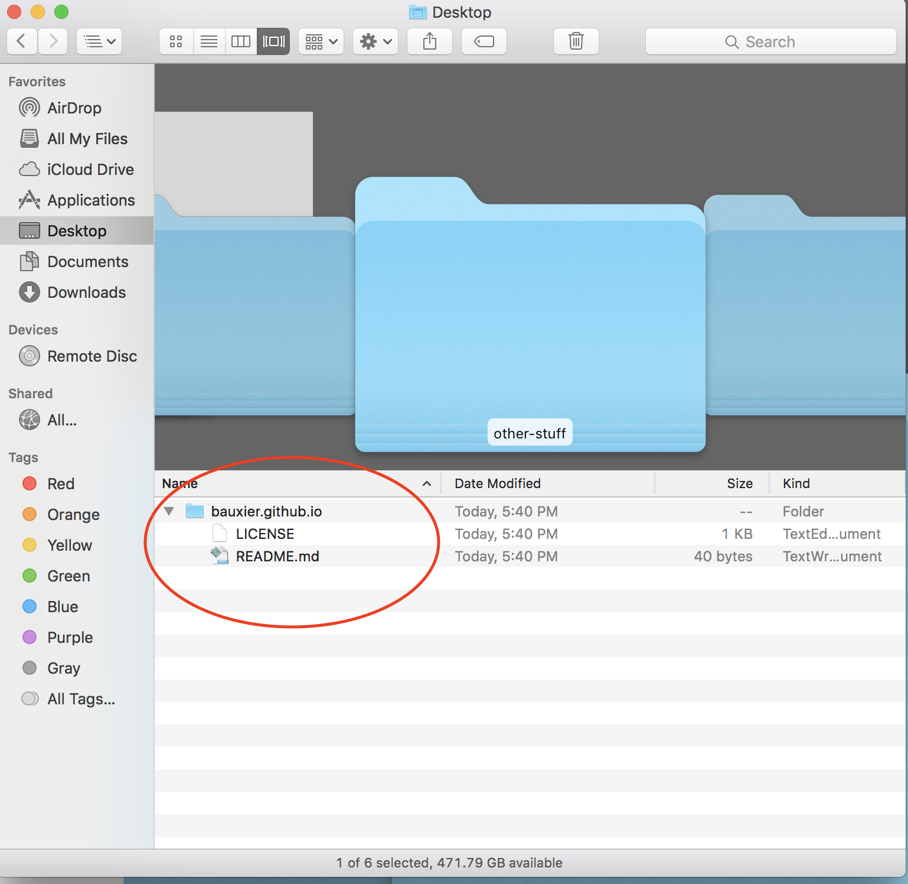

# Getting Started with GitHub
#### Hacks Hackers DC February Meetup

## What You'll Learn

This tutorial is designed to serve as a very basic introduction to version control and GitHub.com. Though many people use terminal commands to use Git and GitHub, we will not be doing that in this tutorial, which will make use of software instead.  You'll learn:

* To create a repository (a bucket in which to store code, also known as a repo) on GitHub.com.
* To use the GitHub Desktop app to "clone" the repo (or make a copy of it on your local machine).
* To make changes to files in our repo using the Atom text editor, "commit" those changes, and then transmit them back to the remote copy of the repo on Github.com.
* How to use a free service called [GitHub Pages](https://pages.github.com/) to host a free website.
* To create a separate "branch" -- a separate copy of your files -- then "merge" those changes back into the main branch.  This is a particularly useful skill when you're working on projects with multiple collaborators.
* To make a copy of someone else's repo -- a "fork" -- to your own GitHub.com account.

## What You Won't Learn

* Any command line stuff.
* A whole bunch of other cool stuff you can do with Git and GitHub. This is just the basics.  

## Requirements for this Tutorial

* Sign up for a free [GitHub.com account](GitHub.com/join)
* Download and install [GitHub Desktop](https://desktop.github.com/)

## Recommended for this Tutorial
* Download and install [Atom](https://atom.io/), a text editor from GitHub.
* This tutorial will be written for people using iOS.  You should be able to do all of this on a Windows environment, but some things might look slightly different.  

## Step 1: Sign into GitHub.com and create a new repository

1. Sign into GitHub.com.

2. In the upper right corner of the page, click the "+" dropdown menu and select "New repository," which will take you to the "Create a New Repository" Page.

3. Name your repository in the "Repository Name" field. Future repos you create can be anything you like. GitHub says "Great repository names are short and memorable." But for *this* tutorial, your username should be three words, separated by periods -- username.github.io -- with your actual GitHub username swapped out for username.  So if your username is bauxier, your repo will be called bauxier.github.io. Also set the description to "My personal website".

4. Finish filling out the form:

*  Set the repo to "public". With future repos, you can shield them from public viewing, but you'll have to pay a monthly membership fee.
*  Check the "Initialize with README" box. This will create a file in the repo called "README.md". ".md" is the extension for "markdown" files, a text file that allows you to easily style text (like html, but easier). More on this later.
*  Leave the "Add .gitignore" file set to "None". You may choose to initialize future repos with a gitignore, which allows you to easily prevent certain files in a local repository -- like a file containing database passwords -- from being hosted in a public repository where someone can steal them.  For this project, though, we won't need one.
*  Choose a license people must adhere to when reusing your code. MIT is a good default choice. More info on [ChooseALicense.com]( https://choosealicense.com/)       

5. Click the green "Create a Repository" button.

6. Congrats, you created your first repo! It should look something like this:

7. Double congrats! By creating a repo called *username.github.io*, you also created a very simple -- and free -- website, which you can access at https://username.github.io. If your username is bauxier, you can get to your site at https://bauxier.github.io. We're using GitHub.com as a web server of sorts. Your site should look something like this:

The page you see is your README.md file rendered as HTML in the browser. In the next step, we'll change it a bit.     

## Step 2: Open GitHub Desktop and clone the repo.

1. Open the GitHub Desktop App.  From the GitHub Desktop toolbar at the top left corner of the screen, select "Preferences".

2. Click the first blue "Sign In" button, the one under "GitHub.com Sign in to your GitHub.com account to access your repositories." Enter your GitHub.com username and password. (Do not click the second blue button, the one next to "Enterprise").

3. Now let's pull down the repo you just created on Github.com, by clicking the rightmost button, "Clone a Repository."

4. Under the heading "Your Repositories" you should see the repo you just created, which will look something like username/username.github.io.  Click on it to select it. Click the grey "Choose" button to set the local destination of the repo to your Desktop.  Click the blue "Clone" button.

5. You should now have a local copy of the repo on your desktop, which you can confirm by opening a finder window and navigating to the desktop. Your folder should contain a license file and README.md.

7.  Congrats! You cloned your first repo.

## Step 3: Open the repo folder in Atom and make some changes.

1.  Open Atom, the text editor.  From the top bar menu, select File > Add Project Folder.

2.  Select your repo folder from your desktop.  Be sure to choose the entire folder, NOT just one file within it. Click the "open" button.

3.  From the project file left sidebar, select README.md.  Your file should look something like this:  

4.  Let's make two changes to the text of README.md. Delete the line of text that reads "My Personal Website."  In its place, add the text "Learning GitHub is fun.".  After making the changes, save the file. And for more information on how to use markdown to style text, GitHub has a [good guide]  (https://guides.github.com/features/mastering-markdown/)

5.  Let's also create a new file in this folder, index.html by going to the menu File > New File.  After the file is created, go to the menu File > Save and make sure to save it in your repo folder as index.html. Add a line of text that says "This is my personal GitHub Pages site." Save the file once more. On to the next step!

## Step 4: Review your changes in GitHub Desktop and push the changes to the repo copy on GitHub.com.

1. Move back to the GitHub Desktop App.  You'll notice it looks different now.  

On the left sidebar, under "changes" we see two files listed, README.md and index.html. README.md has a yellow dot next to it, indicating the file has been modified.  Index.html has a green plus sign next to it, indicating the file has been newly added. If we'd deleted a file, it would show up on this list with a red minus sign next to it.

3. The changes to each file are detailed in the window on the right.  Our new file, index.html, had one line of text added to it.  This new text has been highlighted in green, and has a plus sign in the left margin.  

Now click on README.md in the left sidebar.

Notice that the line we deleted "My Personal Website" has been highlighted in red and has a minus sign in the left margin. The line we added "Learning Github is fun." has been highlighted with green and a plus sign in the left margin.

4.  Now let's make those changes an official part of our Git package by "commiting" the changes, and writing a little message to describe them in the form in the lower corner.  

In the "summary" box, write "Added index.html, tweaked README", and in the description box write "Added a single line of text to index.html, and changed the body text in README".  It's important to write useful and descriptive commit messages.  

Click the blue "Commit to Master button". Congrats! You've made your first commit!

5.  Now, click the "Push origin" button in the upper left corner to write the changes to GitHub.com.

6.  Congrats! You've made your first commit and pushed it to GitHub.  Let's go to the repo page on GitHub to check it out.

Notice some changes:

* It says our latest commit was 3 minutes ago.
* The index.html file is now there
* The README file text has changed.
* Our latest commit message shows up next to the two files we changed.    

7.  Now let's go look at our website, at username.github.io.  It's changed too.  It's now loading the text from the index.html file.  If we make changes to this file in the future, it will change too.

## Step 5: Create a new branch of .
